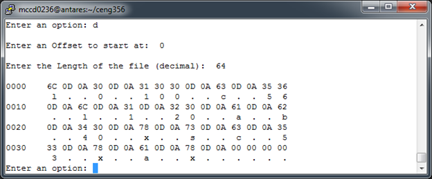
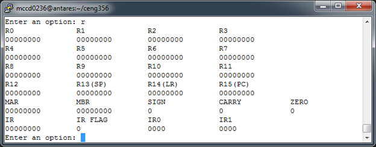
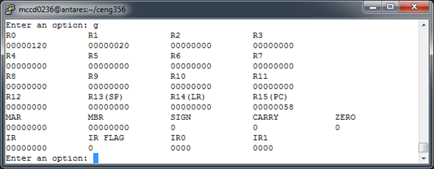

Virtual CPU
===========

Created by: Hennok Tadesse & Derek McCreery

 

### **Description**

This virtual CPU is created in C language to perform registry level simulation
of a CPU based on the ARM Cortex M0+ architecture. The CPU’s memory size is
16Kbytes and uses 32-bit registers. The program has a simple user interface that
would allow users to test machine level programs written for the CPU. The CPU
executes various instructions based on the file in memory. The CPU has other
features such as load file, memory dump, memory modify, write file, reset
registers and display registers.

 

### **State of the Program**

Currently the program is able to perform all of the required functions set out
by the projects goals.  We were also able to implement a version of the Trace
function that works independently from the Fetch function as I was unable to
implement that.

 

### **Sample Output**

Memory Dump:

 

Register Display:

 

Displayed registers after running through a program:

 

### **Testing**

Currently the program can only read in very specifically made programs and that
would be a cause of many errors or even segmentation faults.  Other than this
the program works correctly and I was unable to find any errors.  To test that
each implemented function was working in both the Go and Trace functions, I ran
a program that used all of them.  This file is included in the .zip file and is
named “test.txt”.

 

### **Conclusions**

In conclusion, this project was used to show us and think critically about how a
CPU would work form a logical point of view.  I believe that the assignment was
a good approach to further teach and reinforce the some of the ideas presented
in the course.  From here, to further the project, additional functions should
be added as well as making some of the existing code more flexible, for example
having the inputs more than one character long.
